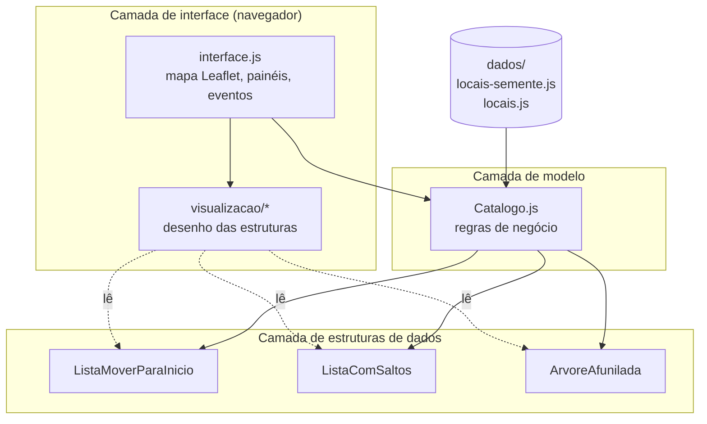
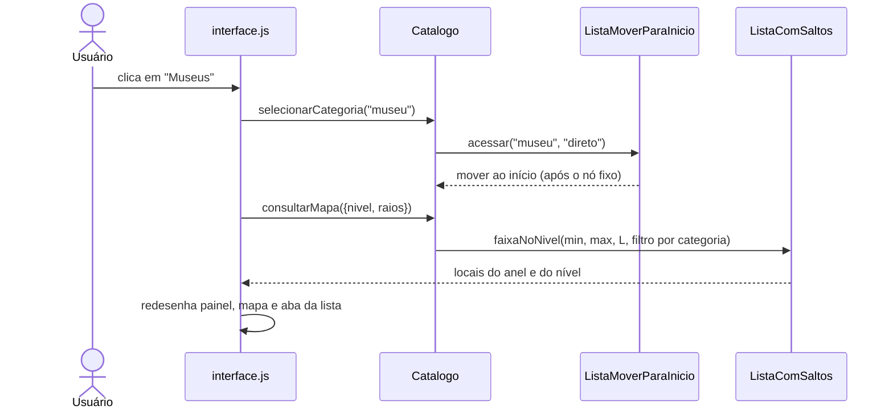
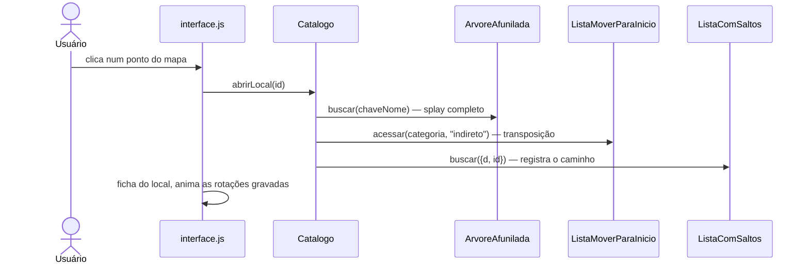

# 01 – Arquitetura

## Visão geral em camadas

A aplicação tem três camadas. Cada uma conhece apenas a camada de baixo:

**Estruturas** (`src/estruturas/`). Não sabem que existe um mapa. Recebem chaves, valores e comparadores genéricos. As modificações ficam aqui, e por isso cada uma pode ser testada isoladamente no Node.js.

**Modelo** (`src/app/Catalogo.js`). Recebe os registros brutos, monta as estruturas e expõe operações com nomes da aplicação: `selecionarCategoria`, `abrirLocal`, `previsualizarLocal`, `pesquisar`, `consultarMapa`, `definirOrigem`. É aqui que se decide, por exemplo, que abrir um local é um acesso **indireto** à categoria dele.

**Interface** (`src/app/interface.js` e `src/visualizacao/`). Traduz cliques em chamadas ao catálogo e desenha o resultado. Ela nunca filtra, ordena nem busca dados por conta própria: tudo o que aparece na tela vem de uma consulta às estruturas.

## Onde cada local fica armazenado

Os locais não ficam guardados num vetor que a interface percorre. Depois da carga, eles estão em duas estruturas:

| Índice | Estrutura | Chave | Contém |
|---|---|---|---|
| Espacial | Lista com saltos | `{ d: distância à origem, id }` | todos os locais (nível 0) |
| Textual | Árvore afunilada | `"nome normalizado\0id"` | todos os locais |
| Categorias | Lista com movimentação ao início | `"praia"`, `"museu"`... | as categorias com cor, símbolo e contagem |

O vetor `catalogo.locais` existe apenas como carga inicial e como acesso direto por `id` (por exemplo, para transformar o `id` de um marcador clicado de volta no objeto do local).

O mesmo objeto de local é referenciado pelas duas estruturas, sem cópia. Assim, quando a origem muda, a distância gravada no objeto é atualizada uma única vez.

## Fluxo de cada ação do usuário

### Escolher uma categoria

### Abrir um local

### Passar o mouse sobre um ponto

`previsualizarLocal(id)` chama `buscar(chaveNome, { maxPassos: 1 })`: o nó sobe um único passo (zig, zig-zig ou zig-zag). A lista de categorias não muda.

### Digitar na pesquisa

`pesquisar(texto)` normaliza o texto e chama `buscarPorPrefixo`. Um único splay leva o primeiro resultado à raiz; os demais são obtidos por sucessor em ordem.

### Mover a origem

`definirOrigem(lat, lon)` recalcula a distância de todos os locais e reconstrói a lista com saltos. Custa O(n log n). Como a altura de cada local é sorteada com semente fixa (modificação S3), os mesmos locais continuam aparecendo em cada nível de detalhe.

## Responsabilidade de cada arquivo

| Arquivo | Responsabilidade |
|---|---|
| `src/estruturas/ListaMoverParaInicio.js` | Lista encadeada com nós fixos, política híbrida e estatísticas |
| `src/estruturas/ListaComSaltos.js` | Lista com saltos com comparador, sorteador por relevância, faixa por nível e caminho |
| `src/estruturas/ArvoreAfunilada.js` | Splay ascendente com splay parcial, prefixo, tamanhos, registro de rotações e construção balanceada |
| `src/util/geo.js` | Haversine, normalização de nomes, formatação de distâncias e coordenadas |
| `src/app/Catalogo.js` | Montagem das estruturas e operações da aplicação |
| `src/app/interface.js` | Mapa, painéis, eventos, textos explicativos, animação do splay |
| `src/visualizacao/desenhoLista.js` | Cadeia de nós com transição CSS (o nó "viaja" ao mudar de posição) |
| `src/visualizacao/desenhoSaltos.js` | Visão geral por níveis e detalhe com torres e ponteiros |
| `src/visualizacao/desenhoArvore.js` | Topo da árvore em SVG, com subárvores recolhidas mostradas como "+N" |

## Decisões técnicas

**JavaScript puro, sem etapa de compilação.** O projeto abre com um clique no `index.html`, o que facilita a avaliação e a apresentação.

**Módulos UMD.** Cada arquivo de estrutura termina com um pequeno trecho que exporta para `module.exports` (Node.js) ou para `window` (navegador). Módulos ES (`import`) não funcionam ao abrir o arquivo diretamente com `file://`.

**Dados em `.js`, e não em `.json`.** Navegadores bloqueiam `fetch` de arquivos locais. Um arquivo `.js` que define `self.LOCAIS_WIKIDATA` carrega com uma tag `<script>` comum.

**Desenho em canvas.** Os marcadores usam o renderizador em canvas do Leaflet (`preferCanvas`), que suporta milhares de pontos sem travar.

**Visualização limitada ao que cabe na tela.** A árvore é desenhada só até uma profundidade escolhida (`topo(p)` copia O(2^p) nós). A lista com saltos mostra uma visão geral compacta e um detalhe de 16 nós. Assim o desenho custa o mesmo com 200 ou com 50.000 locais.

## Como estender

- **Nova categoria**: acrescente uma entrada em `CATEGORIAS_PADRAO` (`Catalogo.js`) e em `CATEGORIAS` (`gerar_base_wikidata.py`), com a classe correspondente do Wikidata.
- **Outro critério de ordem na lista com saltos**: troque a chave `{ d, id }` e o comparador em `Catalogo.definirOrigem`. A lista aceita qualquer comparador.
- **Outra intensidade de splay parcial**: altere o segundo argumento de `catalogo.previsualizarLocal(id, passos)` em `interface.js`.
